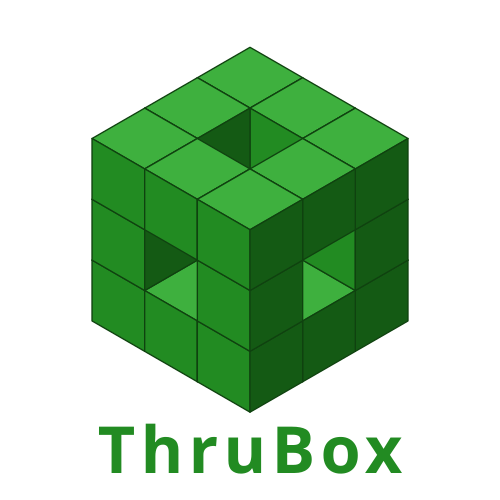

<!-- Don't delete it -->
<div name="readme-top"></div>

<!-- Organization Logo -->
<div align="center" style="display: flex; align-items: center; justify-content: center; gap: 16px;">
  
  
</div>

&nbsp;

<!-- Organization Name -->
<div align="center">

[](https://aossie.org/)

</div>

<!-- Organization/Project Social Handles -->
<p align="center">
<!-- Telegram -->
<a href="https://t.me/StabilityNexus">
</a>
&nbsp;&nbsp;
<!-- X (formerly Twitter) -->
<a href="https://x.com/aossie_org">
</a>
&nbsp;&nbsp;
<!-- Discord -->
<a href="https://discord.gg/hjUhu33uAn">
</a>
&nbsp;&nbsp;
<!-- LinkedIn -->
<a href="https://www.linkedin.com/company/aossie/">
  </a>
&nbsp;&nbsp;
<!-- Youtube -->
<a href="https://www.youtube.com/@AOSSIE-Org">
  </a>
</p>


<p align="center">
  <a href="https://scorecard.dev/viewer/?uri=github.com/AOSSIE-Org/ThruBox-Client">
    
  </a>
  &nbsp;&nbsp;
  <a href="./BestPracticesChecklist.md">
    
  </a>
  &nbsp;&nbsp;
  <a href="https://github.com/gitleaks/gitleaks">
    
  </a>
</p>

---

<div align="center">
<h1>ThruBox Client SDK</h1>
</div>

A **zero-dependency** TypeScript SDK for the [ThruBox Server](https://github.com/AOSSIE-Org/ThruBox-Server). Send, receive, and manage encrypted messages with a simple API. Works in Node.js 18+ and modern browsers.

---

## 🚀 Features

- **Zero Runtime Dependencies**: Only devDependencies for build/test
- **Typed Errors**: Specific error classes for rate limiting, payload size, not found, etc.
- **Automatic Retry**: Exponential backoff on 5xx and network errors
- **Polling**: Built-in `poll()` helper with a stop function
- **Dual Format**: Ships ESM + CJS with TypeScript declarations
- **Tiny**: ~2.5 KB minified

---

## 💻 Tech Stack

- TypeScript 5+
- tsup (build)
- Vitest (testing)
- Native `fetch` API (no HTTP library dependency)

---

## 🍀 Getting Started

### Install

```bash
npm install @aossie-org/thrubox-client
```

### Quick Start

```typescript
import { RelayClient } from '@aossie-org/thrubox-client';

const relay = new RelayClient('https://relay.example.com');

// Send an encrypted message
await relay.send({
  to: '0xRecipientWallet',
  from: '0xSenderWallet',
  payload: encryptedBase64String,
});

// Receive messages
const messages = await relay.receive('0xMyWallet');

// Delete a message after reading
await relay.delete(messages[0].id);
```

---

## 🛠️ Development

To build and test the SDK itself (not just consume it):

```bash
git clone https://github.com/AOSSIE-Org/ThruBox-Client.git
cd ThruBox-Client
npm install

npm run build     # build ESM + CJS output with tsup
npm test          # run the Vitest suite
npm run coverage  # run tests with coverage
npm run lint      # ESLint
```

---

## 📖 API Reference

### `new RelayClient(baseUrl, options?)`

| Option | Type | Default | Description |
|--------|------|---------|-------------|
| `apiKey` | `string` | — | API key for authenticated servers |
| `timeout` | `number` | `10000` | Request timeout in ms |
| `retries` | `number` | `3` | Retry attempts on network errors / 5xx |

### `relay.send(params): Promise<Message>`

Send an encrypted message to the relay.

### `relay.receive(address): Promise<Message[]>`

Fetch all messages for a wallet address.

### `relay.delete(id): Promise<void>`

Delete a specific message by ID.

### `relay.poll(address, callback, options?): () => void`

Auto-poll for new messages. Returns a stop function.

```typescript
const stop = relay.poll('0xMyWallet', (messages) => {
  console.log('New messages:', messages);
}, { intervalMs: 5000 });

// Later: stop polling
stop();
```

### `relay.health(): Promise<HealthResponse>`

Check server health.

---

## ⚠️ Error Handling

```typescript
import { RelayRateLimitError, RelayPayloadTooLargeError } from '@aossie-org/thrubox-client';

try {
  await relay.send({ to, from, payload });
} catch (e) {
  if (e instanceof RelayRateLimitError) {
    console.log(`Rate limited. Retry after ${e.retryAfter}s`);
  }
  if (e instanceof RelayPayloadTooLargeError) {
    console.log('Payload exceeds server limit');
  }
}
```

---

## 🔗 Repository Links

1. [ThruBox Client](https://github.com/AOSSIE-Org/ThruBox-Client) — This repository (TypeScript SDK)
2. [ThruBox Server](https://github.com/AOSSIE-Org/ThruBox-Server) — Go relay server

---

## 🙌 Contributing

⭐ Don't forget to star this repository if you find it useful! ⭐

Thank you for considering contributing to this project! Contributions are highly appreciated and welcomed. To ensure smooth collaboration, please refer to our [Contribution Guidelines](./CONTRIBUTING.md).

---

## ✨ Maintainers

- [Bruno](https://github.com/Zahnentferner)
- [Atharva](https://github.com/Atharva0506)

---

## 📍 License

This project is licensed under the GNU General Public License v3.0.
See the [LICENSE](LICENSE) file for details.

---

## 💪 Thanks To All Contributors

Thanks a lot for spending your time helping ThruBox grow. Keep rocking 🥂

[](https://github.com/AOSSIE-Org/ThruBox-Client/graphs/contributors)

© 2025 AOSSIE
